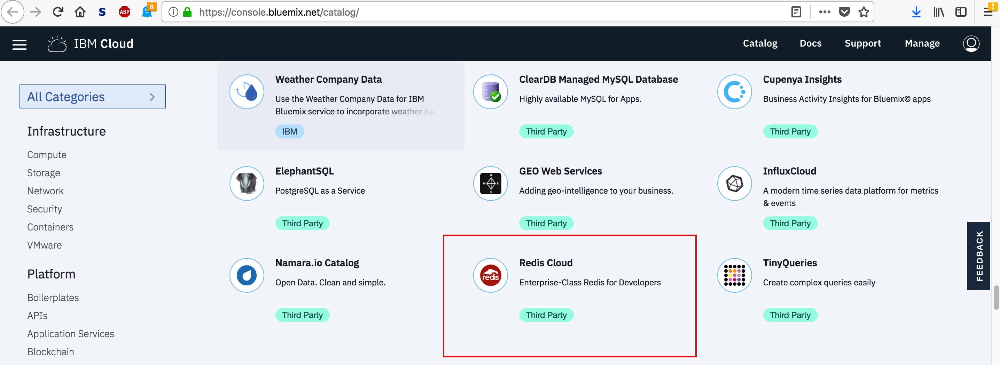
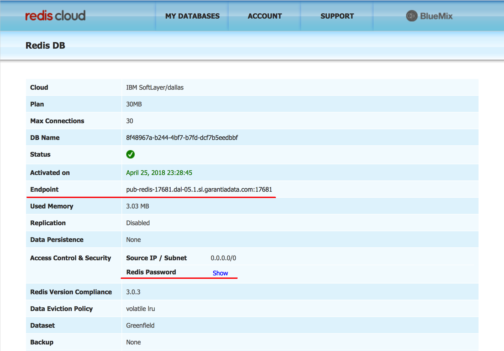

# Lab 2 Deploy an application with a manually provisioned backing store

Learn to manually provision a Redis instance, and manually connect it to an
application hosted on the IBM Kubernetes Service.

# Deploy your application

If you're continuing from Lab 1, you can skip this step. Otherwise, run

```
$ kubectl run guestbook --image=ibmcom/guestbook:v1
$ kubectl expose deployment guestbook --type="NodePort" --port=3000
```

This will deploy Guestbook and expose a port so you can connect to it. Note that
it is storing state locally in memory.

# Manually provision a Redis instance

We want some sort of stable backing store for our application to store it's state in. For the purposes
of this workshop, we'll be using a service available publically on IBM Cloud. While it would technically
be possible to plug this service directly into our Kube cluster using the IBM Cloud Dashboard, this step is
really a stand in for any sort of manually provisioned service. It could be a pre existing legacy service, or
a service managed using some other workflow. 

Head over to the [IBM Cloud Catalog](https://console.bluemix.net/catalog/) and search for the 
Redis Cloud service. Provision an instance of the free 30 MB tier service.



Once the service is provisioned, go to [your dashboard](https://console.bluemix.net/dashboard/apps) and it
should be listed under "Cloud Foundry Services". Click on the Redis entry and then click through to the dashboard.
Then, click on your specific instance, and you should find information for your specific instance:



Note the listed endpoint and password for your instance. We will be using this information to
connect Guestbook to your Redis instance in the next step.

# Connect Guestbook to your Redis instance.

Back in Guestbook, we need to somehow get this information into out application. For this workshop,
we'll insert it manually as environment variables into our containers. Run `kubectl edit deployment guestbook`
and add the following information in bold:

<pre>
apiVersion: extensions/v1beta1
kind: Deployment
metadata:
  annotations:
    deployment.kubernetes.io/revision: "1"
  creationTimestamp: 2018-05-22T00:14:04Z
  generation: 1
  labels:
    app: guestbook
  name: guestbook
  namespace: default
  resourceVersion: "597"
  selfLink: /apis/extensions/v1beta1/namespaces/default/deployments/guestbook
  uid: 099103c8-5d55-11e8-826c-7273b59914b4
spec:
  progressDeadlineSeconds: 600
  replicas: 1
  revisionHistoryLimit: 10
  selector:
    matchLabels:
      app: guestbook
  strategy:
    rollingUpdate:
      maxSurge: 25%
      maxUnavailable: 25%
    type: RollingUpdate
  template:
    metadata:
      creationTimestamp: null
      labels:
        app: guestbook
    spec:
      containers:<b>   
      - env:
        - name: REDIS_MASTER_SERVICE_HOST
          value: "INSERT HOSTNAME HERE"
        - name: REDIS_MASTER_SERVICE_PORT
          value: "INSERT PORT HERE"
        - name: REDIS_MASTER_SERVICE_PASSWORD
          value: "INSERT PASSWORD HERE"</b>
        image: jberkhahn/guestbooktest
        imagePullPolicy: Always
        name: guestbook
        ports:
        - containerPort: 3000
          name: http-server
          protocol: TCP
        resources: {}
        terminationMessagePath: /dev/termination-log
        terminationMessagePolicy: File
      dnsPolicy: ClusterFirst
      restartPolicy: Always
      schedulerName: default-scheduler
      securityContext: {}
      terminationGracePeriodSeconds: 30
status:
  availableReplicas: 1
  conditions:
  - lastTransitionTime: 2018-05-22T00:14:09Z
    lastUpdateTime: 2018-05-22T00:14:09Z
    message: Deployment has minimum availability.
    reason: MinimumReplicasAvailable
    status: "True"
    type: Available
  - lastTransitionTime: 2018-05-22T00:14:04Z
    lastUpdateTime: 2018-05-22T00:14:09Z
    message: ReplicaSet "guestbook-7bdf589c97" has successfully progressed.
    reason: NewReplicaSetAvailable
    status: "True"
    type: Progressing
  observedGeneration: 1
  readyReplicas: 1
  replicas: 1
  updatedReplicas: 1
  </pre>

Note that you'll have to split the hostname and port out of the endpoint information you
got from your redis dashboard. Alternatively, you can delete your old deployment, fill in
the information in `manual_guestbook_deployment.yaml` in this directory, and run
`kubectl create -f manual_guestbook_deployment.yaml`, to get the same effect.

Once you've done that, you should be able to head back to your webpage, and see Guestbook running.
If you press the /info button, you should see the information about the Redis instance you're
connected to. Try inputtig a few values into the application. Then, run `kubectl get pods`
and grab the name of your pod. Run `kubectl delete pod PODNAME` and then wait for Kubernetes
to deploy a new pod. When you refresh your page, the information should still be there.

So now we've connected our application to some stable storage to persist our data, but manually
provisioning the Redis instance and manually editing our deployment yaml is a bit cumbersome.
In [the next lab of this course](../Lab3/README.md) we'll learn to abstract some of that hassle
away by using a Kubernetes Secret to encapsulate our credentials.

When you're all done, you can either use this deployment in the next lab,
or you can remove the deployment and thus stop taking the course.

  1. To remove the deployment, use `$ kubectl delete deployment guestbook`.

  2. To remove the service, use `$ kubectl delete service guestbook`.
