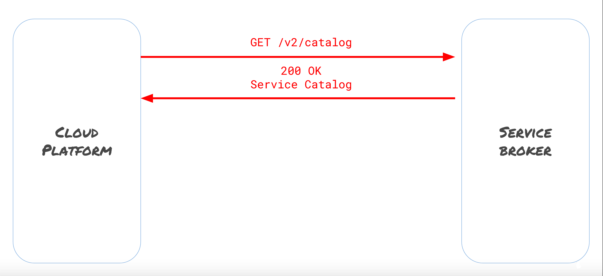

# Open Service Broker API

Cloud native applications are ephemeral but still require the use of stable storage, databases,
caches, email systems, billing systems, etc. Developers need to provide for these needs somehow,
but it would be preferable if they could focus on the thing they actually care about: developing
their application. Similarly, Cloud platform providers need some way to provide for these needs,
but are more rightly more concerned with managing their platform.

The Open Service Broker aims to solve these problems by providing a open standard to create brokers
that allow application developers to provision, maintain, and consume services in a without having 
to know what's going on behind the scenes. If you need a Redis store, you can request one from
a service broker, bind it to your application, and go. Anything that can be decomposed into the
service broker action lifecycle of provison, bind, unbdind, and deprovision can be offered as an
OSB service, from databases to subscriptions to web APIs.

OSB API describes five object types: brokers, services, plans, instances, and bindings.

* Brokers are a server that implements the OSB API and offers available services, e.g. a Redis broker.
* Services are a category of services offered by a broker, e.g. Redis stores. In Kubernetes,
these are referred to as Service Classes.
* Plans are a specific type of a Service that a Broker offers, e.g. version 4.0.9 of Redis.
* Instances are a single provisioned instance of a Plan, e.g. Jonathan's v4.0.9 Redis store.
* Bindings are a unique set of credentials to access a specific Instance, e.g. a username/password/host/port for Jonathan's v4.0.9 Redis store.

The [API specification](https://github.com/openservicebrokerapi/servicebroker) describes five
endpoints for a broker to implement: catalog, provision, bind, unbind, and deprovision.

* Catalog returns a list describing the services offered by the Broker.
* Provision takes a Service and Plan ID, and creates an Instance
* Bind takes an Instance ID and returns a Binding containing credentials to access that Instance
* Unbind takes a Binding ID and deletes the Binding
* Deprovision takes an Instance ID and deletes the Instance

# /v2/catalog Endpoint

In Lab 4, we provisioned a service broker, and added it to Service Catalog. When that happaned,
the Service Catalog controller issued a GET request to the /v2/catalog endpoint on the broker.
That request flow looks like this:



The 200 OK response contains a JSON body that details all the offerings from this particular broker:
```
{
  "services": [
    {
      "id": "abc",
      "name": "redis",
      "description": "Open source, advanced key value store...",
      ...
      "plans": [{
              "id": "123",
              "name": "3-2-9",
              ...
        },
        {
              "id": "456",
              "name": "4-0-9",
              ...
        },
}
```

Services is an array containing information about each of the Services offered by the broker - 
these are what Service Catalog calls Classes. Within each Service, there are many fields containing
metadata about the Service itself, as well as an array of Plans. Each entry in this array contains
information about a single Plan, including it's ID, a human-readable name, as well as many fields of
metadata and descriptions.
