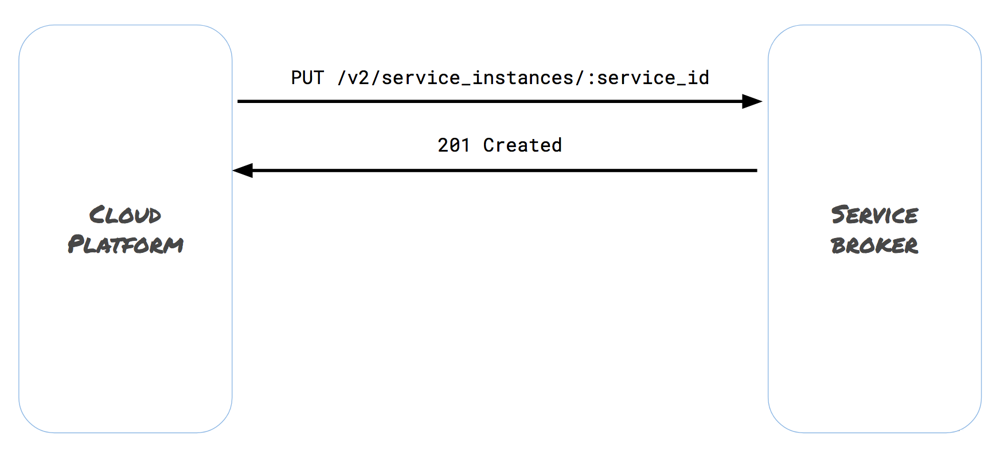

# Open Service Broker API - Provisioning a Service Instance

Provisioning is the action by which a cloud platform requests for a Broker to instatiate
a specific plan of a specific service. In the Redis example, this would be asking a Redis 
Broker to create an instance of the Redis service Class of the version 4.0.9 Plan. 

# /v2/service_instances/:service_id Endpoint

In Lab 5, we provisioned a Service Instance using svcat. When that happened, Service Catalog
issued a PUT request to the /v2/service_instances/:service_id endpoint of Minibroker that
contained the ID of the Instance to be created, and the Class and Plan to create. The Broker
provisioned a Redis instance for us. Minibroker did this by deploying pods to our local Kube
cluster, but an OSB broker could accomplish this in anwy way - deploying resources to a cloud platform,
creating an account to a pre-existing resource, or even having people hook things up on the back end
manually. That request flow looked like this:



:service_id is the platform-provided unique identifier to reference this particular Instance.
The request contains a JSON body that contains additional information needed 
to provision the Instance:

```
{
  "service_id": "abc",
  "plan_id": "123",
  "context": {
    "platform": "kubernetes",
    "some_field": "some-contextual-data"
  },
  "organization_guid": "org-guid-here",
  "space_guid": "space-guid-here",
  "parameters": {
    "parameter1": 1,
  }
}
```

Service ID is the id of the Service Class that was returned in the /v2/catalog response (see more
about that [here](../Lab4/osbapi.md). This is the Class that we are requesting an instance of. Similarly,
Plan ID is the identifier for the Plan we want the instance to conform to. Organization and space guids are
abstractions left over from Cloud Foundry, where the OSB API was started. The context map is the current
version of this, and contains information specific to each platform. Finally, the parameters map is how the
platform can pass along arbitrary information in the provision request, if required by the broker.

The 201 CREATED response contains a simple JSON body that looks like this:
```
{
 "dashboard_url": "http://example-dashboard.example.com/9189kdfsk0vfnku",
  "operation": "task_10"
}
```

Dashboard URL is an address where information about the Instance can be found, while
operation specifies what the last operation performed on the Instance was.
